<div align="center">

---

## About the Game

REBOOT is a single-player 2D fighting game that runs entirely in the browser. You pick one of **15 fighters**, then take on AI opponents in a story campaign, best-of-N arcade matches, a 10-floor tower, or a training room.

Combat is built around a **charge-based block system** (three blocks that you win back by landing hits) and **stamina-gated escape moves** (backdash, roll, spot dodge, each with its own cooldown icon in the HUD), so matches are about timing and spacing rather than attack spam. The story is a tongue-in-cheek take on a coding-bootcamp admission: you arrive late, and the only way in is to survive the "audits".

Everything — engine, physics, hit detection, AI, HUD and menus — is roughly **7,400 lines of hand-written ES-module JavaScript** across 22 files, rendered with plain DOM elements and CSS sprite sheets.

## Game Preview

<p align="center">
  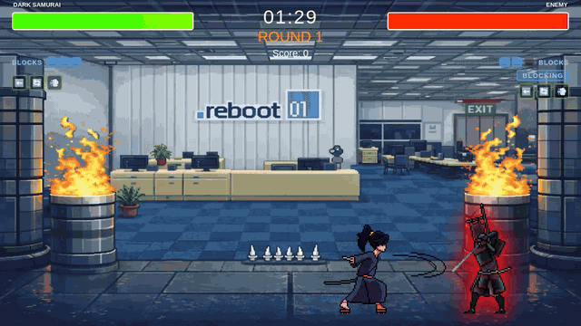
  <br>
  <sub>Real gameplay capture: approach → attacks → block → roll → KO → victory screen.</sub>
</p>

<table>
  <tr>
    <td width="50%">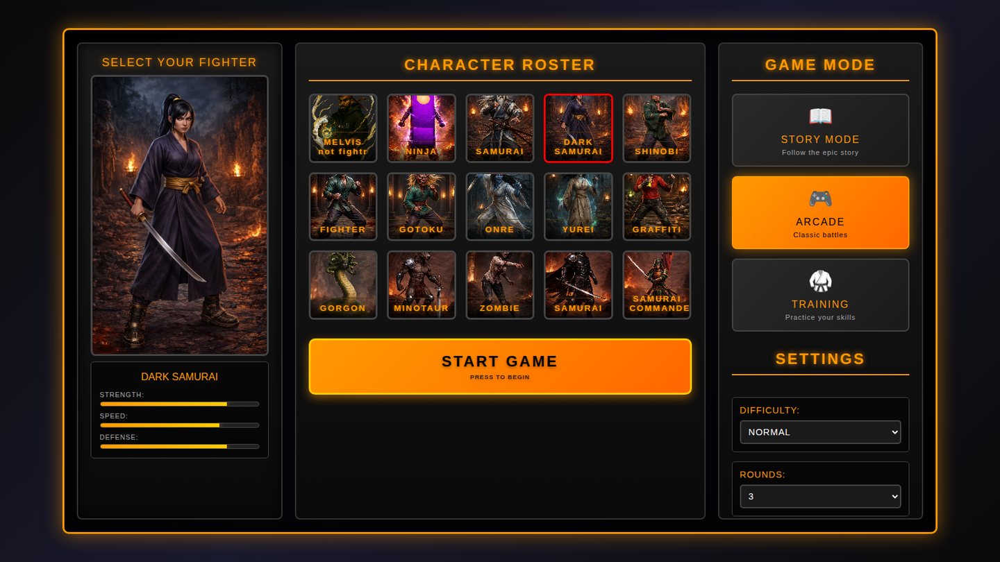</td>
    <td width="50%">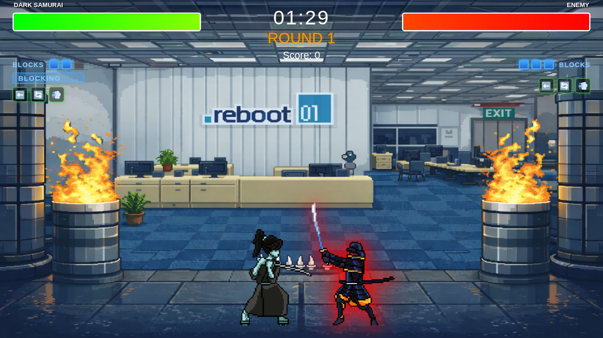</td>
  </tr>
  <tr>
    <td align="center"><b>Character select & mode picker</b><br><sub>15 fighters, 3 menu modes, difficulty, rounds, 19 stages</sub></td>
    <td align="center"><b>Defense HUD in action</b><br><sub>Block charges, BLOCKING state, escape cooldown icons</sub></td>
  </tr>
  <tr>
    <td>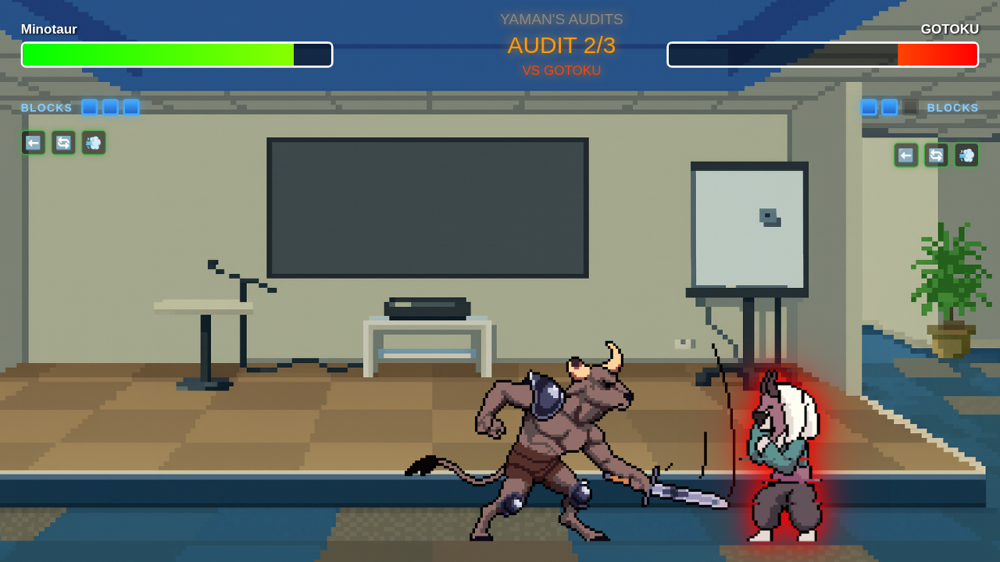</td>
    <td>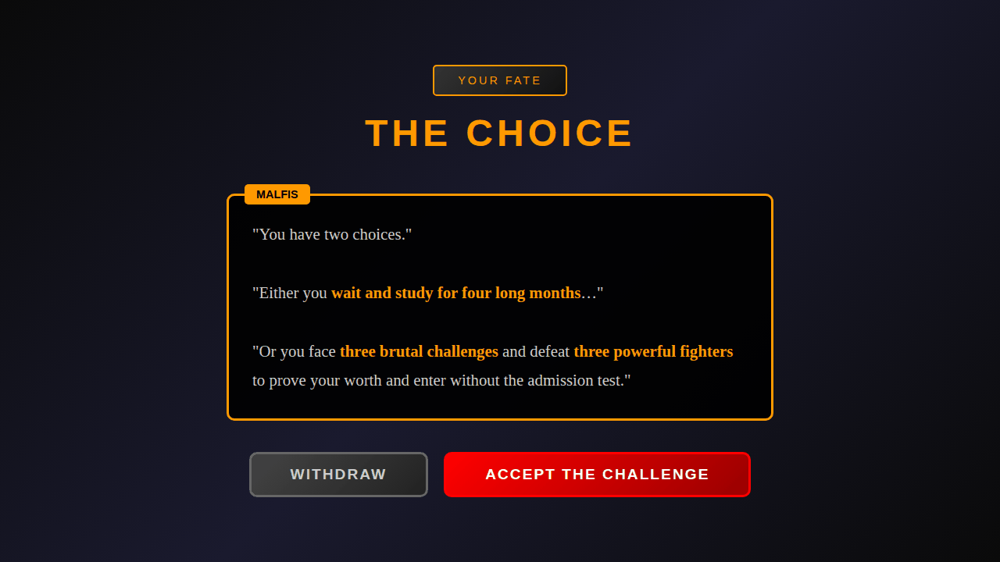</td>
  </tr>
  <tr>
    <td align="center"><b>Story mode — audit fight</b><br><sub>Consecutive opponents, your HP carries over</sub></td>
    <td align="center"><b>Story mode — dialogue</b><br><sub>Scripted scenes between fights</sub></td>
  </tr>
  <tr>
    <td>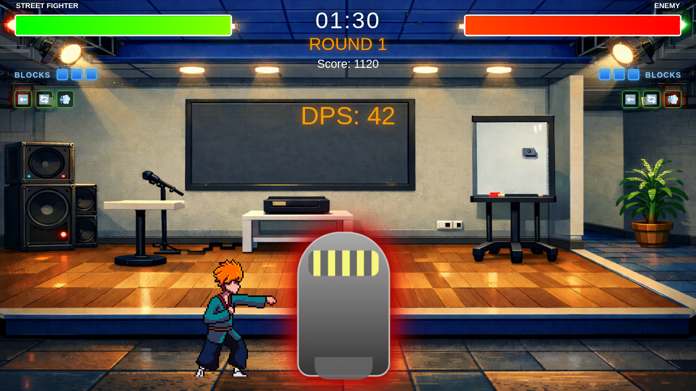</td>
    <td>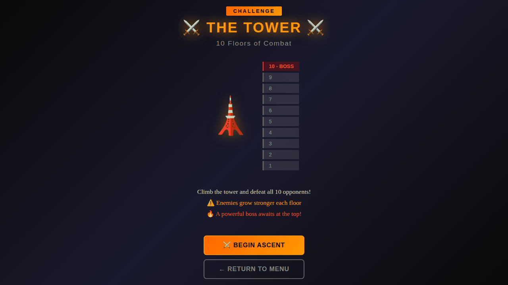</td>
  </tr>
  <tr>
    <td align="center"><b>Training mode</b><br><sub>Live DPS counter, unkillable dummy</sub></td>
    <td align="center"><b>Tower mode</b><br><sub>10 floors, boss on top, progress saved</sub></td>
  </tr>
  <tr>
    <td>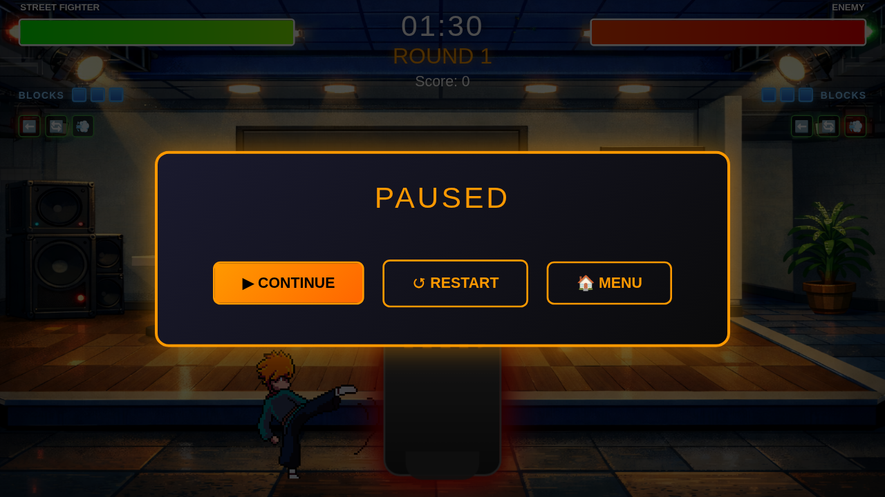</td>
    <td>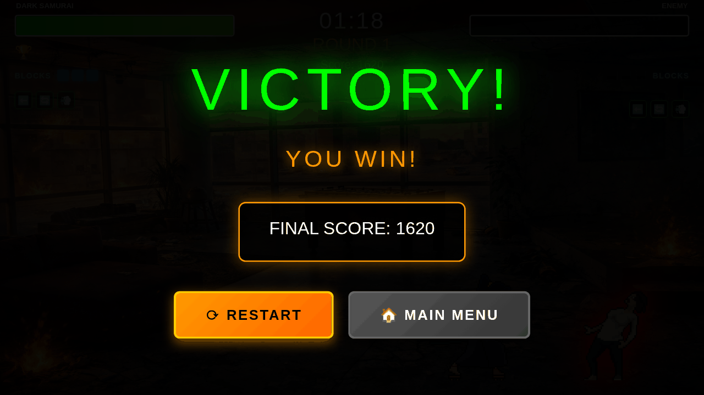</td>
  </tr>
  <tr>
    <td align="center"><b>Pause menu</b><br><sub><code>Esc</code> freezes the game loop</sub></td>
    <td align="center"><b>Victory screen</b><br><sub>Score, restart or back to menu</sub></td>
  </tr>
</table>

---

## Game Modes

| Mode               | What it is                                                              |                                                 In the menu?                                                 |
| ------------------ | ----------------------------------------------------------------------- | :----------------------------------------------------------------------------------------------------------: |
| **Story**    | Scripted campaign with dialogue scenes and three fight stages           |                                                      ✅                                                      |
| **Arcade**   | Best-of-N matches against a random AI fighter on a stage of your choice |                                                      ✅                                                      |
| **Training** | Free practice against a dummy with a live DPS counter                   |                                                      ✅                                                      |
| **Tower**    | 10-floor gauntlet with scaling enemies and saved progress               | ⚠️ implemented, but the menu button is commented out — open[`docs/tower.html`](docs/tower.html) directly |

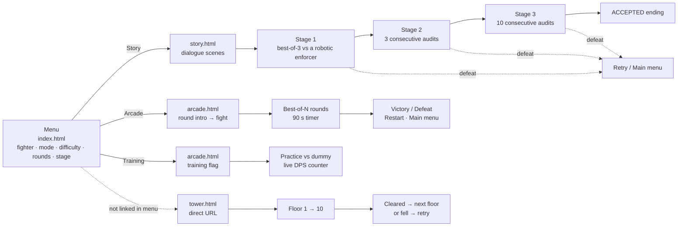

Press `Esc` during any fight to pause (Continue / Restart / Menu in arcade and training; Back to Story in story mode; Restart Floor / Exit Tower in tower mode).

### Story Mode

You arrive late at a coding bootcamp. You can wait four months for the admission test, or accept a challenge: defeat three fighters instead.

- **Stage 1** — best-of-3 against a robotic enforcer (a CSS-drawn enemy; stats 60 / 50 / 45).
- **Stage 2 — "Yaman's Audits"** — three back-to-back fighters (random roster picks, 70 HP each, hard AI). **Your HP carries over**; there is no healing between audits.
- **Stage 3 — "Ahmed Abdeen's Audits"** — ten back-to-back fighters (50 HP each, normal AI), again with carried-over HP. Surviving ends on the **ACCEPTED** screen.
- Defeat offers *Retry* or *Main Menu*. Story mode has no save state, and ignores the menu's difficulty/rounds settings (stages use presets). Your chosen fighter's stats are used.

### Arcade Mode

- One opponent per match, picked at random from the 13 sprite fighters; you choose difficulty (**Easy / Normal / Hard / Expert**), rounds (**1 / 2 / 3 / 5**) and one of **19 stages** (or random).
- A round lasts **90 seconds**. On time-out the fighter with more HP wins (a tie goes to the player). First to ⌈N/2⌉ round wins takes the match.
- Score: +10 per point of damage dealt, +500 per round won. Music loops during arcade and training.

### Training Mode

- A static dummy in the middle of the stage that never attacks or moves and **restores its health after every hit**.
- A rolling **1-second DPS counter** appears as you hit it. No KO, no round logic; the timer is frozen.

### Tower Mode

- **10 floors**, each a best-of-3 against a randomly assigned fighter with a rank title (e.g. *"Rookie Dark Samurai"*). Floor 10 is a boss.
- Enemy stats scale with the floor (strength and speed ×(1 + 0.25·floor) from a per-floor base, defense +2 per floor; the boss gets an extra ×1.5 strength and ×1.3 defense).
- Progress (`unlockedFloor`) is saved in `localStorage`; the intro screen shows a **Continue** button after your first cleared floor.

---

## Controls

Keyboard only. There is no remapping, gamepad or touch support. Bindings use physical key codes (`KeyboardEvent.code`).

| Action            | Keys                            | Notes                                            |
| ----------------- | ------------------------------- | ------------------------------------------------ |
| Move left / right | `A` `D` or `←` `→`    | Sprite fighters walk at`300 + 2 × speed` px/s |
| Jump              | `W` or `↑`                 | Only from the ground                             |
| Attack            | `Space` or `J`              | Ground only; 0.5 s cooldown; not while blocking  |
| "Heavy" attack    | `U`                           | Bound, but currently triggers the same attack    |
| Block             | hold`Shift` (either) or `K` | Each absorbed hit uses one block charge          |
| Backdash          | `Q`                           | Moves away from the opponent                     |
| Roll              | `E`                           | Moves in the facing direction                    |
| Spot dodge        | `R`                           | Stays in place                                   |
| Pause             | `Esc`                         | All fight screens; menus are mouse-driven        |

---

## Combat & Defense System

Fighters are **auto-facing**: they always turn toward the opponent unless attacking, hurt or escaping.

**What happens when an attack connects**

1. The attacker's *attack box* (100×80 px) becomes active at the middle frame of the attack animation for 100 ms and is tested (AABB) against the target's *hurtbox* (40 % × 90 % of the sprite). One swing can register only once.
2. **Damage** = `floor(12 + strength / 8)` (e.g. 22 at strength 80).
3. If the target is **blocking and has a block charge**, the hit is fully negated, one charge is spent, and the target is pushed back.
4. Otherwise the target takes `max(1, floor(damage × (1 − defense / 200)))`, is knocked back, and enters a **0.4 s hit-stun** during which it cannot be hit again.
5. Every **2 unblocked hits you land** restore **1 block charge** — so blocking is a resource you earn by being aggressive, not a free turtle.

**Escape moves** (`Q` / `E` / `R`) each have a duration, a cooldown shown as an icon in the HUD, and an invincibility window that the HUD labels `INVINCIBLE`.

**Stamina** is a hidden 100-point pool (there is no on-screen bar) that *only* gates escapes. It regenerates at 15/s after 0.5 s without spending. Attacking, blocking and walking cost nothing.

<details>
<summary><b>Verified constants</b> (from <code>js/core/combat-system.js</code>, <code>js/entities/sprite-fighter.js</code>; confirmed by instantiating the modules in a browser)</summary>

| Property                 | Value                                                                                                                                     |
| ------------------------ | ----------------------------------------------------------------------------------------------------------------------------------------- |
| Max health               | 100 (120 for the unused`boss` AI preset)                                                                                                |
| Attack cooldown          | 0.5 s                                                                                                                                     |
| Hit-stun after being hit | 0.4 s                                                                                                                                     |
| Block charges            | 3 max; +1 per 2 landed hits; pushback 3                                                                                                   |
| Stamina                  | 100 max · regen 15/s · regen delay 0.5 s                                                                                                |
| **Backdash**       | 20 stamina · duration 0.3 s · cooldown 0.8 s · i-frame window 0 – 0.15 s                                                              |
| **Roll**           | 45 stamina in practice (25 charged by the fighter + 20`ROLL.STAMINA_COST`) · duration 0.5 s · cooldown 1.2 s · window 0.05 – 0.35 s |
| **Spot dodge**     | 15 stamina · duration 0.25 s · cooldown 0.6 s · window 0.02 – 0.18 s                                                                  |
| Sprite size × scale     | 128 px × 2 (arcade/training) or × 2.5 (story/tower); 96 px sprites ×2.5; 256 px sprites ×1.25                                         |
| Stage                    | 960 × 540 logical pixels; ground at`540 − height − 20`                                                                               |

</details>

---

## Fighters

The menu offers **15 fighters** (none are locked). **14 are animated sprite fighters**; *Shadow Ninja* is a plain CSS-gradient placeholder fighter.

All fighters share the **same moveset** (one attack, block, three escapes). What differs is **stats and visuals**: the menu's strength / speed / defense are passed to your fighter and directly drive damage (`floor(12 + STR/8)`), walking speed (`300 + 2·SPD`) and damage reduction (`1 − DEF/200`). Most fighters have three attack animations that are picked at random; damage is identical.

|  # | Fighter           | STR | SPD | DEF | Visuals                             |
| -: | ----------------- | --: | --: | --: | ----------------------------------- |
|  1 | melvis            |  50 |  50 |  50 | Sprite (minimal frames)             |
|  2 | Shadow Ninja      |  65 |  90 |  60 | CSS-gradient placeholder            |
|  3 | Pixel Samurai     |  75 |  80 |  65 | Sprite, 96 px                       |
|  4 | Dark Samurai      |  80 |  75 |  80 | Sprite, 3 attack animations         |
|  5 | Shinobi           |  70 |  95 |  55 | Sprite, 3 attack animations         |
|  6 | Street Fighter    |  85 |  80 |  70 | Sprite, 3 attack animations         |
|  7 | Gotoku            |  90 |  65 |  80 | Sprite, 3 attack animations         |
|  8 | Onre              |  75 |  85 |  70 | Sprite, 3 attack animations         |
|  9 | Yurei             |  70 |  90 |  65 | Sprite, 3 attack animations         |
| 10 | Graffiti Artist   |  75 |  85 |  65 | Sprite, 256 px, 3 attack animations |
| 11 | Gorgon            |  90 |  60 |  85 | Sprite, 3 attack animations         |
| 12 | Minotaur          |  95 |  55 |  90 | Sprite, single attack               |
| 13 | zombie            |  85 |  65 |  80 | Sprite, single attack               |
| 14 | samurai           |  80 |  70 |  75 | Sprite, 3 attack animations         |
| 15 | samurai commander |  90 |  75 |  85 | Sprite, 3 attack animations         |

Opponents do **not** use these menu stats: arcade enemies use a fixed 70 / 65 / 60 (then modified by difficulty), story and tower enemies use preset values.

---

## Opponent AI

Opponents (`SpriteEnemy`, `js/entities/sprite-enemy.js`) are a small **state machine** — `idle`, `approaching`, `retreating`, `attacking`, `blocking` — re-evaluated on a timer (`decisionInterval`):

- **Distance bands:** < 100 px (close: attack, retreat or block), 100–250 px (approach or hold), > 250 px (approach or idle).
- **Reactive blocking:** if the player is mid-attack within 180 px, the AI usually raises a block for 0.5–0.8 s. It uses the same 3-charge block system as the player, so it can be blocked out and punished.
- **Difficulty** (menu: Easy / Normal / Hard / Expert) changes how often the AI decides, and how hard it hits and how tanky it is:

| Difficulty | Decision interval | Strength × | Defense × |
| ---------- | ----------------: | ----------: | ---------: |
| Easy       |             0.6 s |         0.7 |        0.7 |
| Normal     |             0.4 s |         1.0 |        1.0 |
| Hard       |            0.25 s |         1.2 |        1.2 |
| Expert     |            0.15 s |         1.3 |        1.3 |

The AI does not use backdash, roll or spot dodge.

---

## Technical Highlights

- **Zero-dependency, modular ES6 architecture** — 22 modules, `import`/`export` only; no `package.json`, no CDN, no bundler.
- **Own game loop** (`core/engine.js`) on `requestAnimationFrame`, with the frame delta clamped to 100 ms so a backgrounded tab can't cause a physics explosion, and a pause that actually stops the rAF chain.
- **Config-driven defense state machine** (`DefenseSystem`) — `neutral / standing_block / backdash / roll / spot_dodge` driven by a single `DEFENSE_CONFIG` object, so every timing, cooldown and cost is tunable in one place.
- **Data-driven fighters** — `CHARACTER_TYPES` describes each sprite sheet (frame size, frame count, per-animation frame duration); one `SpriteFighter` class renders all 14 sprite characters.
- **AABB hit detection** with separate hurtbox / attack box and a once-per-swing hit registry.
- **Reusable multi-opponent fights** — `AuditsManager` spawns opponents one after another while the player's state (HP, position) persists, with callbacks for start/end/complete/death.
- **Edge-triggered keyboard manager** (`core/input.js`) exposing `isDown` for held keys and `justPressed` for single-frame actions.
- **Resolution-independent stage** — a fixed 960×540 logical stage made of three DOM layers (background / entities / UI), scaled to the viewport with a CSS `transform` on resize (no `<canvas>`).
- **GPU-friendly rendering** — fighters are moved with `transform: translate()` (pixel-snapped, `will-change: transform`) and animated by shifting `background-position` on a pre-loaded sprite sheet.
- **Tower progression** with floor-based stat scaling and `localStorage` persistence; **training** DPS computed over a rolling 1-second window.

---

## Architecture

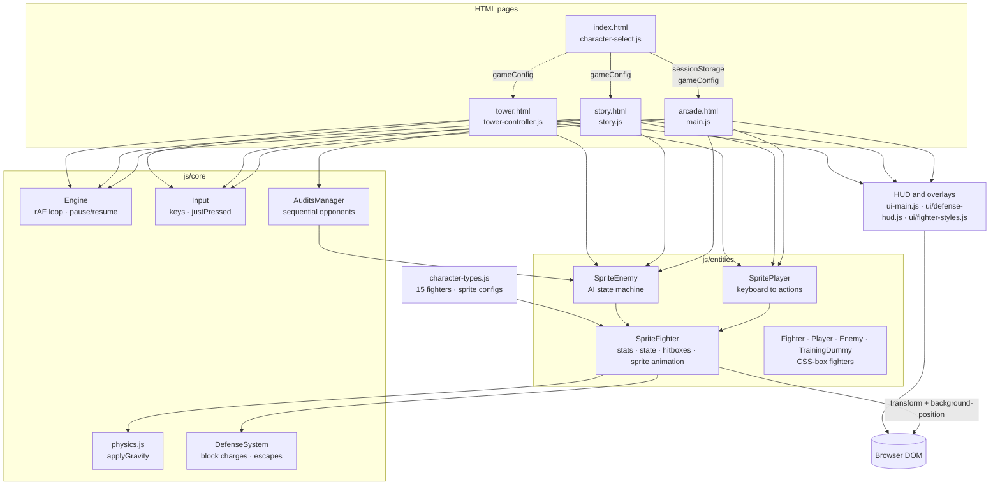

<details>
<summary><b>Module reference</b></summary>

| Module                                                                         | Responsibility                                                                                                       |
| ------------------------------------------------------------------------------ | -------------------------------------------------------------------------------------------------------------------- |
| `js/character-select.js`                                                     | Menu controller; writes`gameConfig` (fighter, mode, difficulty, rounds, stage) to `sessionStorage` and navigates |
| `js/character-types.js`                                                      | `CHARACTER_TYPES`: sprite-sheet config for each of the 15 roster entries                                           |
| `js/main.js`                                                                 | Arcade + training controller: setup, round logic, hit resolution, pause, game over                                   |
| `js/story.js`                                                                | Story controller: scene navigation, stage fights, audit fights, defeat / victory                                     |
| `js/tower-controller.js`, `tower-data.js`, `tower.js`                    | Tower controller, floor settings / scaling / enemy generation, entry wrapper                                         |
| `js/ui-main.js`                                                              | Layered stage setup + scaling, HUD, health bars, pause / game-over overlays, training DPS                            |
| `js/ui/defense-hud.js`                                                       | Block-charge icons, state label, escape cooldown icons                                                               |
| `js/ui/fighter-styles.js`                                                    | Injected CSS for fighter bodies and hit / block effects                                                              |
| `js/core/engine.js`                                                          | `Engine`: rAF loop, dt clamp, pause / resume                                                                       |
| `js/core/input.js`                                                           | `Input`: held / just-pressed key state                                                                             |
| `js/core/physics.js`                                                         | `applyGravity` (plus two helpers that are currently unused)                                                        |
| `js/core/combat-system.js`                                                   | `DEFENSE_CONFIG`, `DefenseSystem` (block charges, escapes, cooldowns)                                            |
| `js/core/audits-manager.js`                                                  | `AuditsManager`: sequential opponents with persistent player state                                                 |
| `js/entities/sprite-fighter.js`                                              | `SpriteFighter`: stats, state machine, hitboxes, sprite animation, damage, DOM rendering                           |
| `js/entities/sprite-player.js` / `sprite-enemy.js`                         | Keyboard control / AI on top of`SpriteFighter`                                                                     |
| `js/entities/fighter.js`, `player.js`, `enemy.js`, `training-dummy.js` | CSS-box fighter family (Shadow Ninja, the training dummy)                                                            |

</details>

---

## How the Game Works

### Game loop

Every fight screen builds an `Engine(update, render)`. Each animation frame runs the same sequence:

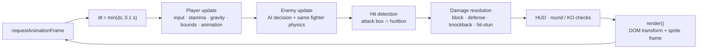

### Physics & collision

- **Horizontal movement** is scaled by `dt`; knockback and escape impulses decay with a ×0.85 friction per frame.
- **Gravity** adds `30 · dt` to vertical velocity; the ground is `y = 540 − height − 20`, and fighters are clamped to `x ∈ [0, 960 − width]`.
- **Hit detection** is axis-aligned box overlap between the attacker's active attack box and the defender's hurtbox. Fighters do not collide body-to-body.

### Rendering & animation

- **DOM-based**, not canvas: each fighter is an absolutely-positioned `<div>` flipped with `scaleX(±1)`, containing a child `<div>` whose `background-image` is a horizontal sprite strip.
- A frame is selected by shifting `background-position` by `frame × spriteWidth × scale`; `image-rendering: pixelated` keeps pixel art crisp. Animations (`idle`, `running`, `attacking` ×3, `hurt`, `blocking`, `dead`) have per-frame durations; the attack hitbox turns on at the animation's middle frame.
- Sprite images are pre-loaded with `new Image()` when a fighter is created.

### Input

`Input` listens to `keydown` / `keyup` on `window` and keeps a held-key map plus a one-frame `justPressed` set, which the game clears after each update. Movement, jump and block use held state; attack and escapes use `justPressed`.

### State & persistence

- The menu hands its choices to the next page through `sessionStorage` (`gameConfig`).
- Only Tower progress is persisted across sessions (`localStorage`, key `towerProgress`).
- Audio uses `HTMLAudioElement` (menu hover sound, looping music in arcade / training).

---

## Tech Stack

| Area                   | Technology                                                                    |
| ---------------------- | ----------------------------------------------------------------------------- |
| Game logic             | JavaScript (ES2015+ modules, classes)                                         |
| Interface              | HTML5                                                                         |
| Styling                | CSS3 (3 stylesheets, transitions and keyframe animations)                     |
| Rendering              | DOM + CSS transforms + CSS sprite sheets (no canvas)                          |
| Audio                  | HTMLAudioElement                                                              |
| Storage                | `sessionStorage` (menu → mode hand-off), `localStorage` (tower progress) |
| Libraries / frameworks | **None** — vanilla JavaScript, no build step                           |
| Hosting                | GitHub Pages                                                                  |
| Version control        | Git / GitHub                                                                  |

---

## Project Structure

```text
make-your-game/
├── index.html                  # redirects to docs/ (used by GitHub Pages)
├── README.md
└── docs/                       # the game (served as-is)
    ├── index.html              # menu: fighter, mode, difficulty, rounds, stage
    ├── arcade.html             # arcade + training fights
    ├── story.html              # story scenes + fights
    ├── tower.html              # tower mode (not linked from the menu)
    ├── css/                    # style.css · story.css · tower.css
    ├── js/
    │   ├── main.js · story.js · tower-controller.js · tower-data.js · tower.js
    │   ├── character-select.js · character-types.js · ui-main.js
    │   ├── core/               # engine · input · physics · combat-system · audits-manager
    │   ├── entities/           # sprite-fighter/player/enemy · fighter/player/enemy · training-dummy
    │   └── ui/                 # defense-hud · fighter-styles
    ├── assets/
    │   ├── characters/         # roster portraits
    │   ├── maps/               # stage backgrounds (19 used by the game)
    │   ├── sprites2/ sprites3/ # sprite sheets (Samurai, Shinobi, Fighter, Gotoku, Onre, Yurei)
    │   ├── Sprites/ melvis/ Gorgon_1/ Graffiti_Artist_3/ Minotaur/ Zombie/ Samurai/ Samurai_Commander/
    │   ├── audio/              # music + UI sound
    │   └── ui/                 # avatars
    └── screenshots/            # README images and demo GIF
```

---

## Getting Started

### Live demo

**https://hussainhht.github.io/make-your-game/** — the root page redirects to `/docs/`. Tower mode: `https://hussainhht.github.io/make-your-game/docs/tower.html`.

### Run locally

The game uses ES modules, so it must be served over HTTP — opening the HTML files with `file://` does **not** work (browsers block module scripts there).

```bash
git clone https://github.com/hussainhht/make-your-game.git
cd make-your-game/docs
python3 -m http.server 8000
```

Then open **http://localhost:8000**. Any static file server works equally well. Verified in Chromium; any browser with ES-module support should run it.

### Deploy your own copy on GitHub Pages

1. Push the repository to GitHub.
2. **Settings → Pages → Build and deployment → Source: Deploy from a branch.**
3. Choose **Branch: `main`**, **Folder: `/ (root)`**, then **Save**.
4. Your game appears at `https://<your-username>.github.io/<repo-name>/` (the root `index.html` redirects to `docs/`).

---

## Development

### History

All 4 commits are authored as `hussainali7`, on 2026-02-08. The history starts with a full import of the game, so it records repository preparation rather than feature-by-feature development:

| Commit                   | What changed                                                                                                           |
| ------------------------ | ---------------------------------------------------------------------------------------------------------------------- |
| `be4ed0d` first commit | Imports the game under`game/` (22 JS modules, 3 stylesheets, HTML pages, assets) plus project docs                   |
| `35e8ec0` docs         | Copies the game into`docs/` (for GitHub Pages) and adds the root `index.html` redirect                             |
| `7a037e9` move         | Removes the old`game/` tree and the stand-alone design docs; `docs/` becomes the only game root                    |
| `db167ec` refactor     | Merges`home.html` into `index.html` (the menu is now the landing page), adds `arcade.html`, re-points navigation |

### Known limitations

<details>
<summary>Current implementation notes (what is stubbed, simplified or not yet normalised)</summary>

- **Tower mode** is fully implemented but its menu entry is commented out in `docs/index.html`.
- **One attack type.** `U` ("heavy") is bound but calls the same attack. Parry, crouch, guard meter / guard break, perfect block and chip damage are not implemented (`CHIP_DAMAGE_PERCENT` and some perfect-block hooks exist only as unused constants / stubs).
- **Escapes:** the i-frame windows are tracked and shown in the HUD, but damage is only gated on them in the CSS-box `Fighter` entity (Shadow Ninja); sprite fighters still take damage. The escape impulse is applied in per-frame units, so backdash / roll currently carry the fighter to the stage edge instead of the configured 150 / 200 px.
- **Vertical physics** is integrated per frame rather than per second, so jump height depends on the display refresh rate (horizontal movement is `dt`-scaled).
- **AI difficulty:** per-preset `aggressiveness` and `reactionTime` values are overwritten by constants (0.5 / 0.2) in the `SpriteEnemy` constructor; difficulty currently changes decision cadence, damage and defense (and boss HP).
- Fighters can overlap (no body-vs-body collision; `isColliding()` exists but is unused).
- Tested in Chromium only; no automated test suite.

</details>

## Author

Built by **[hussainhht](https://github.com/hussainhht)**. and balafoo (Bader Alafoo)

## Credits

- Sprite sheets, portraits, stage backgrounds and audio are bundled in [`docs/assets/`](docs/assets). Several sprite sets come from third-party / public sources; per-asset attributions and licenses are not yet recorded in this repository.
- The story and stage art are set in a fictional coding-bootcamp world themed around "Reboot".
